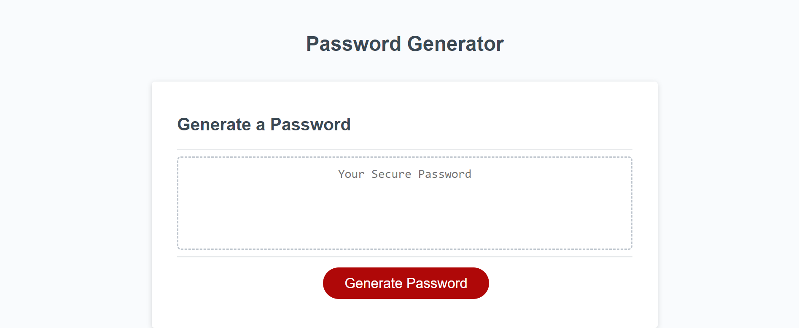

# c3 Random Password Generator 

## Description
This is a website that will generate a random password for the user, using criteria selected by the user. This will allow for the user to create multiple different secure passwords. This generator can be used by accessing it via the link below. 

## Installation

N/A

## Usage

To use this password the user needs to click on the "Generate Password" button and then select the criteria they want to use for their password. Once the criteria is selected a generated password will appear in the password text area. 

## Credits

Katherine Redford was a tremendous help as a tutor throught this process. 

I also used this youtube tutorial video made by Web Dev Simplified to help create the Password Generator.

https://www.youtube.com/watch?v=iKo9pDKKHnc

## License

MIT License

Copyright (c) 2023 Caleb Crouch

Permission is hereby granted, free of charge, to any person obtaining a copy of this software and associated documentation files (the "Software"), to deal in the Software without restriction, including without limitation the rights to use, copy, modify, merge, publish, distribute, sublicense, and/or sell copies of the Software, and to permit persons to whom the Software is furnished to do so, subject to the following conditions:

The above copyright notice and this permission notice shall be included in all copies or substantial portions of the Software.

THE SOFTWARE IS PROVIDED "AS IS", WITHOUT WARRANTY OF ANY KIND, EXPRESS OR IMPLIED, INCLUDING BUT NOT LIMITED TO THE WARRANTIES OF MERCHANTABILITY, FITNESS FOR A PARTICULAR PURPOSE AND NONINFRINGEMENT. IN NO EVENT SHALL THE AUTHORS OR COPYRIGHT HOLDERS BE LIABLE FOR ANY CLAIM, DAMAGES OR OTHER LIABILITY, WHETHER IN AN ACTION OF CONTRACT, TORT OR OTHERWISE, ARISING FROM, OUT OF OR IN CONNECTION WITH THE SOFTWARE OR THE USE OR OTHER DEALINGS IN THE SOFTWARE.
